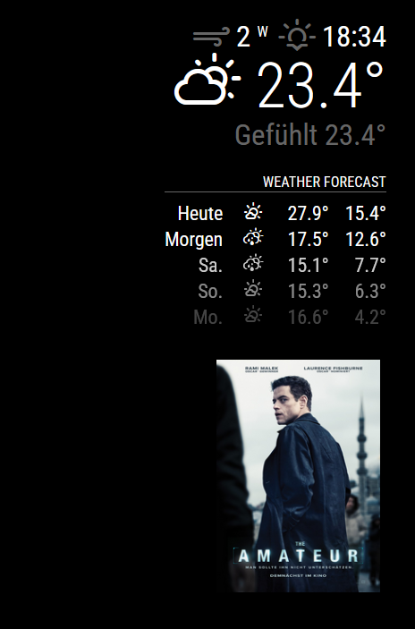

# MMM-Cinestar-FDW

Displays the "Film der Woche" (Movie of the Week) from [Cinestar](https://cinestar.de/) cinemas on your MagicMirror².
This module automatically shows the weekly featured film as soon as it's announced — typically late Wednesday or early Thursday.

## Screenshot



## Dependencies

This module depends on the following external API:

- Cinestar API

  - Free to use, no official documentation available.

  - Public endpoint used by the official Cinestar website.

  - API might be subject to rate limiting or changes at Cinestar’s discretion.

  - No API key required.

## Installation

### Install

1. Clone or download this repository to your [MagicMirror²][mm] modules folder.

   ```bash
   cd ~/MagicMirror/modules
   git clone https://github.com/LukasWestholt/MMM-Cinestar-FDW
   ```

2. Install the necessary dependencies and build the module by running npm install in the module folder.

   ```sh
   cd MMM-Cinestar-FDW
   npm install
   ```

3. Configure the module in your `MagicMirror/config/config.js` file as per the usage instructions (sample configuration).

   ```javascript
   {
     module: "MMM-Cinestar-FDW",
     position: "top_left",
     config: {}
   },
   ```

## Configuration options

| Option                    | Description                                                                                                                                      |
| ------------------------- | ------------------------------------------------------------------------------------------------------------------------------------------------ |
| `cinemaID`                | Cinema Jena, randomly chosen. Location doesn't matter. Film der Woche is same everywhere. <br><br>**Type:** `number`<br> **Default value:** `29` |
| `updateIntervalInSeconds` | Interval to refresh data from server. (min. 120) <br><br>**Type:** `Number`<br> **Default value:** `5 * 60 * 60` (5 h)                           |
| `maxHeight`               | CSS style to limit image height. <br><br>**Type:** `number`<br> **Default value:** `150`                                                         |

## Update

```bash
cd ~/MagicMirror/modules/MMM-Cinestar-FDW
git pull
npm install
```

## Receiving notifications from the module

| Notification       | Description                          |
| ------------------ | ------------------------------------ |
| `CINESTAR_FDW_NEW` | [State](src/types/State.ts) instance |

## Contribution and Development

This module is written in TypeScript and compiled with Rollup.  
The source files are located in the `/src` folder.
Compile target files with `npm run build` or with `npm install`.

Contribution for this module is welcome!

## Developer commands

- `npm run lint` - Run linting and formatter checks.
- `npm run lint:fix` - Fix linting and formatter issues.

# License and Credits

This project is licensed under the MIT License - see the LICENSE file for details.

I've got API details from https://github.com/akorb/cinestar-bot/tree/main. Thank you very much @akorb!

[mm]: https://github.com/MagicMirrorOrg/MagicMirror
